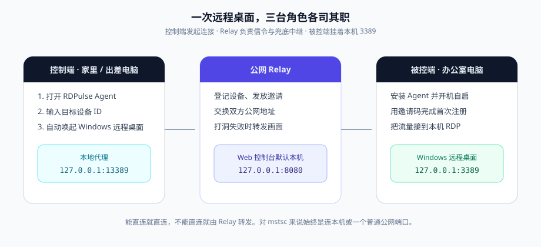
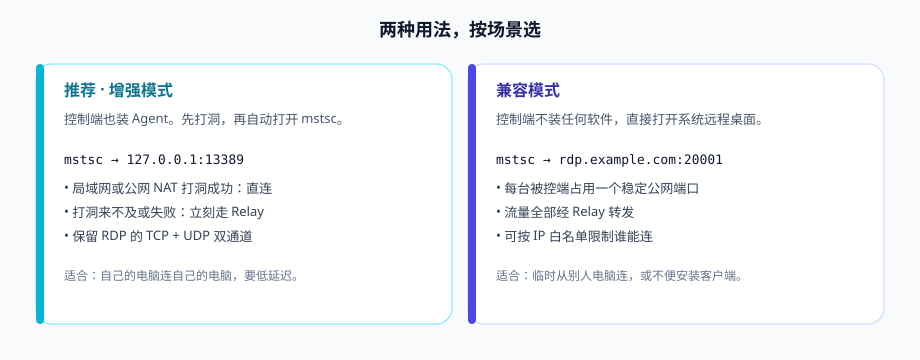
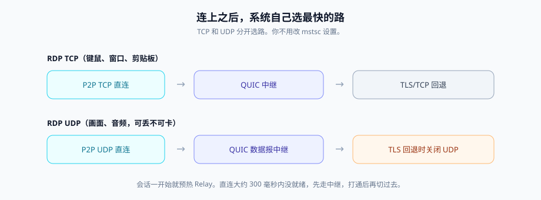
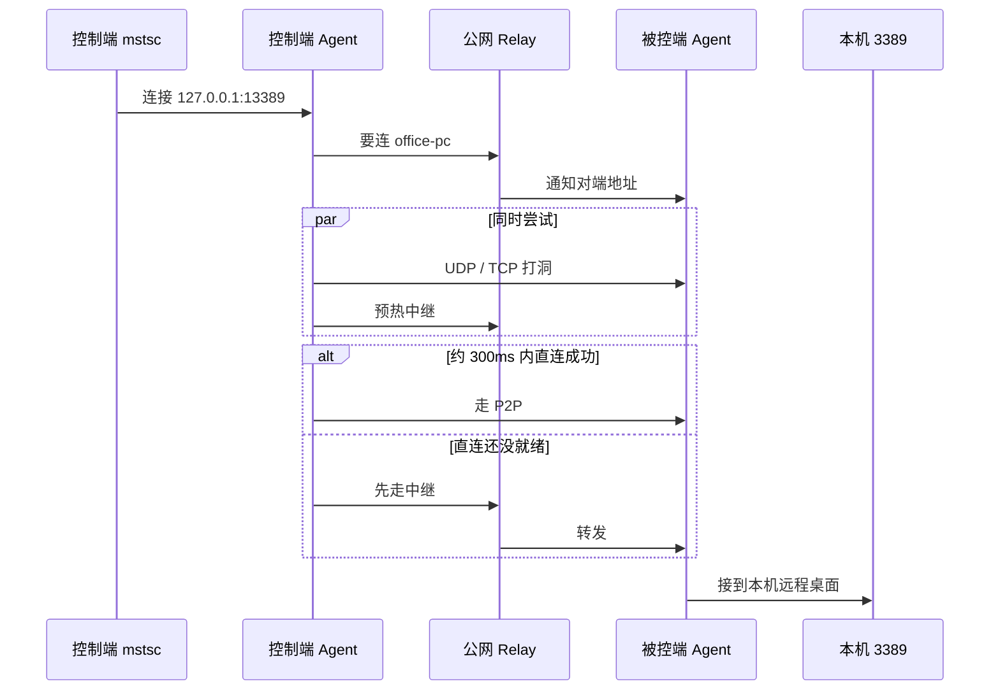
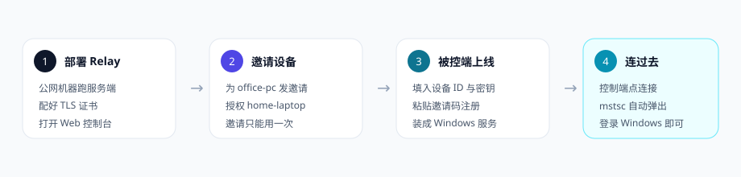

# RDPulse

自己搭一台中继，用 Windows 自带的远程桌面连回家或办公室。能打洞就直连，打不穿就走中继。对 `mstsc` 来说，连的始终是本机或一个普通公网端口。

适合：不想把 3389 裸暴露在公网、又希望画面尽量接近局域网的个人或小团队。

<p align="center">
  
</p>

---

## 目录

- [它解决什么问题](#它解决什么问题)
- [你会用到的三个角色](#你会用到的三个角色)
- [两种连接方式](#两种连接方式)
- [连上之后走哪条路](#连上之后走哪条路)
- [第一次用：四步走通](#第一次用四步走通)
- [日常操作](#日常操作)
- [安全约定](#安全约定)
- [配置说明](#配置说明)
- [自行编译](#自行编译)
- [开发者备注](#开发者备注)

---

## 它解决什么问题

Windows 远程桌面本身很好用：键鼠走 TCP，画面和声音可以走 UDP。麻烦的是公网。

| 常见做法 | 你会碰到什么 |
| --- | --- |
| 路由器直接映射 3389 | 扫描、爆破、端口一变全家断连 |
| frp / nps 一类 TCP 隧道 | 能通，但 RDP 的 UDP 通道经常废掉，拖动窗口发黏 |
| 商业远控 | 账号在别人服务器上，按席位收费 |

RDPulse 把这三件事放在一起：

1. **被控端不用改路由器。** Agent 主动连上你的 Relay，在家宽带或公司 NAT 后面也能被找到。
2. **优先直连。** 同一局域网或 NAT 允许打洞时，画面不绕你的云主机。
3. **直连失败立刻中继。** 会话开始就预热 Relay，不必等打洞超时再重连。

你仍然用系统自带的「远程桌面连接」，不用换一套远控界面。

---

## 你会用到的三个角色

| 角色 | 跑在哪 | 你要做的事 |
| --- | --- | --- |
| **Relay** | 一台有公网 IP 的 Linux / Windows 机器 | 部署服务、配证书、在 Web 控制台发邀请和授权 |
| **被控端** | 要被远程的那台 Windows | 安装 Agent，填设备 ID、密钥、邀请码，建议装成服务 |
| **控制端** | 你手头这台 Windows | 增强模式装同一个 Agent 再点连接；兼容模式直接开 mstsc |

同一份 Agent 程序两种用法：在被控端是「挂着等别人连」；在控制端是「帮你打洞并拉起 mstsc」。

Web 控制台默认只监听本机 `127.0.0.1:8080`。在服务器上用 SSH 隧道打开，不要一上来把管理口暴露到公网。

---

## 两种连接方式

<p align="center">
  
</p>

**增强模式（推荐）**：控制端也运行 Agent。它在本机监听 `127.0.0.1:13389`（TCP + UDP），然后自动执行：

```text
mstsc.exe /v:127.0.0.1:13389
```

你登录的还是 Windows 远程桌面，只是计算机名变成了本机。后面的打洞、中继、切路都发生在 Agent 里。

**兼容模式**：控制端不装软件。Relay 给每台在线被控端分配一个**稳定**公网端口（重启后也不变）。在 mstsc 里填：

```text
rdp.example.com:20001
```

流量全部经 Relay。适合临时从别人电脑连，或策略不允许安装客户端。谁能连这个公网端口，由 Relay 的 IP 白名单决定。

---

## 连上之后走哪条路

<p align="center">
  
</p>

RDP 本来就是两条腿走路，RDPulse 也按两条腿选路，互不等待。

- **TCP**：直连 → QUIC 中继 → 网络封锁 UDP 时再退到 TLS/TCP。
- **UDP**：直连 → QUIC 数据报中继。走到 TLS/TCP 回退时会关掉 UDP，避免「UDP 再包一层 TCP」把卡顿叠起来。

直连报文带会话密钥的完整性校验；中继走 TLS 1.3（QUIC 或 TCP）。你在 mstsc 里不需要勾选特殊选项，系统会按 Windows 自己的策略使用 UDP。



---

## 第一次用：四步走通

下面用一套示例身份，请换成你自己的随机值，不要用文档里的字符串当生产密钥。

| 用途 | 示例值 |
| --- | --- |
| Relay 域名 | `rdp.example.com` |
| 被控端设备 ID | `office-pc` |
| 控制端设备 ID | `home-laptop` |
| 设备密钥 / 邀请码 | 各用至少 32 字节的随机串 |

<p align="center">
  
</p>

### 1. 部署 Relay

公网机器需要放行：

| 端口 | 协议 | 用途 |
| --- | --- | --- |
| 443 | UDP | QUIC 控制面与中继 |
| 443 | TCP | QUIC 被拦时的 TLS 回退 |
| 21116 | UDP | NAT 反射 / 打洞辅助 |
| 20000–39999（按你的配置） | TCP + UDP | 兼容模式的公网映射 |

把 `configs/relay.yaml` 拷到服务器，至少改这几项：

```yaml
rdp:
  publicHost: "rdp.example.com"
  portRange:
    start: 20000
    end: 39999
server:
  quic:
    listen: ":443"
    certFile: "/etc/rdp-relay/tls/fullchain.pem"
    keyFile: "/etc/rdp-relay/tls/privkey.pem"
  tls:
    listen: ":443"
  rendezvous:
    listen: ":21116"
web:
  listen: "127.0.0.1:8080"
  token: ""          # 留空则启动时打印一串随机 Token
```

生产环境必须提供证书。没有证书时进程会拒绝启动；只有本机调试才把 `allowEphemeralCertificate` 设为 `true`。

```bash
./rdp-relay --config /etc/rdp-relay/config.yaml
```

长期运行可用 `scripts/rdp-relay.service`。启动日志里会打印 Web Token，用 SSH 转到本机后再打开控制台：

```bash
ssh -L 8080:127.0.0.1:8080 user@rdp.example.com
```

浏览器打开 `http://127.0.0.1:8080`，把 Token 贴进控制台。不要把 Token 写进网址。

### 2. 在控制台邀请并授权

打开「设备注册邀请」，新增一条：

- 设备 ID：`office-pc`（以及你自己的 `home-laptop`）
- Token：至少 32 字节随机数
- 过期时间：按需要设，过期即作废

邀请按设备绑定，**注册成功后作废**，不能拿同一条再注册第二台。需要重新开放时，换一条新 Token。

再打开「访问授权矩阵」，允许控制端访问被控端，例如：

```yaml
controllerAccess:
  office-pc: ["home-laptop"]
```

没有这条授权，控制端即使自己注册成功，也连不上目标。

### 3. 被控端上线

在办公室电脑编辑 `configs/agent.yaml`（或 GUI 里的「连接设置」）：

```yaml
server:
  address: "rdp.example.com:443"
  tlsAddress: "rdp.example.com:443"
  rendezvousAddress: "rdp.example.com:21116"

device:
  id: "office-pc"
  secret: "请换成至少 32 字节的随机密钥"
  enrollmentToken: "请换成控制台里那条邀请"

rdp:
  address: "127.0.0.1:3389"
```

被控端本机要开启远程桌面。然后：

```powershell
# 前台看日志
.\rdp-agent.exe run --config C:\RDPulse\agent.yaml

# 或双击 rdp-agent.exe / rdp-agent-gui.exe 打开图形界面
```

日志出现注册成功后，**清空 `enrollmentToken` 并重启**，避免邀请码长期躺在配置文件里。

开机自启（管理员 PowerShell）：

```powershell
.\rdp-agent.exe install --config C:\RDPulse\agent.yaml
.\rdp-agent.exe start
.\rdp-agent.exe status
```

Web 控制台的设备列表里，`office-pc` 应变为在线，并看到分配到的公网端口。

### 4. 从控制端连过去

控制端用另一台已注册设备（`home-laptop`），配置里指向同一台 Relay。图形界面填目标 ID `office-pc` 点连接；或命令行：

```powershell
.\rdp-agent.exe connect office-pc --config C:\RDPulse\agent.yaml
```

默认会拉起 `mstsc`。用户名密码仍是办公室那台 Windows 的账号，和直连局域网没有区别。

不想装 Agent 时，看控制台里该设备的公网端口，在任意一台电脑的 mstsc 填 `rdp.example.com:端口`。这就是兼容模式。

---

## 日常操作

### Windows 图形界面

双击 `rdp-agent.exe`（无参数）或 `rdp-agent-gui.exe` 进入桌面程序。常见三块：

- **远程连接**：填目标设备 ID，可选关闭 P2P、是否自动打开 mstsc。
- **本机被控**：把这台电脑挂到 Relay 上，供别人连。
- **连接设置**：Relay 地址、设备 ID、密钥、邀请码、本机 3389 地址。

关窗口会进托盘，不会断开会话。需要彻底退出时从托盘菜单退出。

命令行对照：

```text
rdp-agent.exe                  打开图形界面
rdp-agent.exe gui              同上
rdp-agent.exe run              前台被控
rdp-agent.exe connect <id>     控制端连接
rdp-agent.exe install|start|stop|status|uninstall
```

默认配置路径是 `%USERPROFILE%\.rdpulse\agent.yaml`，可用 `--config` 覆盖。本地代理默认 `127.0.0.1:13389`，可用 `--proxy` 改。

### Web 控制台

本机打开后可以看到：

- **系统概览**：QUIC、Rendezvous、在线设备数
- **设备管理**：启用 / 禁用、公网端口、上次在线
- **设备注册邀请**：发码、作废，不必重启 Relay
- **访问授权矩阵**：谁可以连谁
- **服务端配置 / 实时日志**：改完会写回 `relay.yaml`

禁用某台设备后，它不能再注册、也不能再被连。

### 兼容模式谁能连进来

`security.defaultPolicy` 默认是 `deny`，`allow` 为空时，公网映射端口不接受陌生人。把你家出口 IP 写成 CIDR 再放行，例如 `203.0.113.10/32`。增强模式不走这张表，只认「控制端已注册 + 授权矩阵」。

---

## 安全约定

- 每台设备自己的 `secret` 至少 32 字节，且只保存在该设备上。Relay 库里存的是哈希。
- 邀请码按设备绑定、带过期时间、注册一次即废。
- 控制端必须先作为设备注册，再被写进目标的授权列表。
- Web Token 用请求头或 Cookie，不接受 `?token=`。
- Web 与 Prometheus 默认绑本机。要改成 `0.0.0.0` 时，先配好 Token 和防火墙。
- 打洞和 P2P 数据带会话级校验，防伪造和简单重放；中继通道走 TLS 1.3。

丢失 `secret` 就当作这台设备被冒充：在控制台禁用设备，轮换密钥，重新发一条邀请。

---

## 配置说明

YAML。没写的字段用内置默认值。时间用 Go 写法：`10s`、`500ms`、`2m`。时间点用 RFC 3339，建议加引号。

### Relay（`configs/relay.yaml`）

```yaml
server:
  quic:
    listen: ":443"
    certFile: "/etc/rdp-relay/tls/fullchain.pem"
    keyFile: "/etc/rdp-relay/tls/privkey.pem"
    allowEphemeralCertificate: false   # 生产必须为 false
  tls:
    listen: ":443"
    disabled: false
  rendezvous:
    listen: ":21116"

rdp:
  publicHost: "rdp.example.com"        # 兼容模式展示给用户的主机名
  portRange: { start: 20000, end: 39999 }

udp:
  datagramPayload: 1150
  sessionIdleTimeout: 60s
  reassemblyTimeout: 100ms
  maxSessionsPerAgent: 256
  maxSessionsPerIP: 32
  maxSessionCreateRate: 50

security:
  defaultPolicy: deny
  allow: []                            # 兼容模式 IP 白名单
  enrollmentInvitations: []
  allowAllControllerTargets: false
  controllerAccess:
    office-pc: ["home-laptop"]
  limits:
    maxConnectionsPerIP: 16
    maxConnectionRatePerMinute: 60
    maxEnrollmentRatePerMinute: 5
    maxPublicTCPPerIP: 32
    maxPublicTCPRatePerSecond: 20

storage:
  type: sqlite
  path: "/var/lib/rdp-relay/relay.db"

metrics:
  listen: "127.0.0.1:9090"

web:
  listen: "127.0.0.1:8080"
  disabled: false
  token: ""

log:
  level: info
```

说明：

- 已不再支持全局 `security.enrollmentToken`，写了会启动失败。
- `controllerAccess["office-pc"] = ["*"]` 表示任意已注册控制端都可连这台；`controllerAccess["*"]` 或 `allowAllControllerTargets: true` 表示某个 / 所有控制端可连任意目标。只在你明确要这么做时使用。
- 端口范围含首尾。设备与端口的对应关系在 SQLite 里，Relay 重启后保持不变。

### Agent（`configs/agent.yaml`）

```yaml
server:
  address: "rdp.example.com:443"
  tlsAddress: "rdp.example.com:443"
  rendezvousAddress: "rdp.example.com:21116"
  caCert: ""                           # 私有 CA 时填 PEM 路径
  insecureSkipVerify: false            # 生产必须为 false
  disableQUIC: false
  disableTLSFallback: false
  quicDialTimeout: 4s

device:
  id: "office-pc"
  secret: ""
  enrollmentToken: ""

rdp:
  address: "127.0.0.1:3389"

transport:
  datagramPayload: 1150
  disableP2P: false                    # true 则本端只走中继

udp:
  sessionIdleTimeout: 60s
  reassemblyTimeout: 100ms

heartbeat:
  interval: 10s

reconnect:
  maxInterval: 30s

log:
  level: info
  path: "agent.log"
```

`disableQUIC` 与 `disableTLSFallback` 不要同时为 `true`，否则没有任何中继通道。两端的 `datagramPayload`、`disableP2P` 建议保持一致。

---

## 自行编译

仓库不附带预编译文件。本机有 Go 即可。

Windows（Agent 图形界面 + Relay）：

```powershell
.\build.ps1
```

产物在 `bin\`：`rdp-agent.exe`、`rdp-agent-gui.exe`、`rdp-relay.exe`，以及 Linux amd64 / arm64 的 Relay。

只编某一端：

```powershell
go build -ldflags="-s -w" -o bin/rdp-relay.exe ./cmd/relay
go build -o bin/rdp-agent.exe ./cmd/agent
go build -ldflags="-H=windowsgui" -o bin/rdp-agent-gui.exe ./cmd/agent
```

交叉编译 Relay：

```powershell
$env:CGO_ENABLED = "0"
$env:GOOS = "linux"; $env:GOARCH = "amd64"; go build -ldflags="-s -w" -o bin/rdp-relay-linux-amd64 ./cmd/relay
$env:GOOS = "linux"; $env:GOARCH = "arm64"; go build -ldflags="-s -w" -o bin/rdp-relay-linux-arm64 ./cmd/relay
```

---

## 开发者备注

```text
cmd/relay          服务端入口
cmd/agent          客户端入口（GUI / 被控 / 控制 / Windows 服务）
internal/path      双通道选路
internal/punch     UDP / TCP 打洞
internal/web       Relay 管理控制台
internal/gui       Windows 桌面
configs/           示例配置（均为占位符，不含真实密钥）
docs/images/       README 示意图
```

```powershell
go test ./...
```

真实公网 NAT 场景默认跳过，需要时自行设置 `RDPULSE_EXTERNAL_*` 环境变量后运行 `TestExternalNATEndToEnd`。更细的协议与选路说明见仓库里的设计文档。
